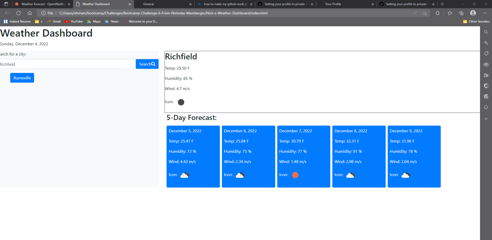

# Nick-s-Weather-Dashboard

## Description
My motivation behind creating this weather dashboard was to get used to using the server side api known as https://openweathermap.org/forecast5 and to create an application out of it. 

This was built to show the weather for 5 days from today from the user's city input choice. Once the city is picked the temp, humidity,wind, and the icon is shown with the next 5 days of the same data.The city that was used as input each time will show up as a clickable button for the user to go back to and use in case they wanted to. 

I learned through a lot of trial and error that making another function is much easier than trying to have one function do a lot of the work. That sounds simple enough to be thought of beforehand but in practice it was learned. My tutor taught me that when we worked on setting the local storage when we made the displaydata() function. I learned how to use the weather api to get the input city then to get the geo data out of it such as longitude and lattitude to find the city weather data. The api had to be called using their specific search parameters. There might have been many ways to call the api but you could only use the ones based off of what you would pay and that gave me a lot of trouble when i tried to use them and they didint work so i had to use the geocoding section and the api call referenced in the read me to the challenge. I learned that going through and checking to see how you called the data in your code was important and how it can dependant the api call subscription, if the api key is right, and the function used to call it and input data into the api through jquery. I tried using ajax, and other methods to call it but jquery was more simple for me to use.    
## Table of Contents

- [Description](#description)
- [Installation](#installation)
- [Usage](#usage)
- [Credits](#credits)
- [License](#license)

## Installation

My website:https://nickhm05.github.io/Nick-s-Weather-Dashboard/
URL of the github repository:https://github.com/NickHM05/Nick-s-Weather-Dashboard

## Usage

:https://cdnjs.cloudflare.com/
https://getbootstrap.com/docs/5.2/getting-started/contents/
https://fontawesome.com/kits
https://www.w3schools.com/xml/ajax_intro.asp  
https://api.jquery.com/
https://github.com/Joelynn94/weather-dashboard/blob/master/assets/js/main.js
Tried to work through and see what each part did in the vs code and learned about the different api calls that people coould use and the functions. His weather conversion math made the most sense when changing over from celsius to fahrenheit

## Credits
 Collaborators:
- Nicholas Mamberger (author) https://github.com/NickHM05
- Krister Myr https://github.com/kristermyr
- Salahuddin Imdad https://github.com/Sal8298

Resource used:https://cdnjs.com/libraries/jquery
https://momentjs.com/
dayjs code from last mini project 
https://en.wikipedia.org/wiki/Degree_symbol

## License
license:(./LICENSE)

MIT License

Copyright (c) 2022 NicholasHM05

Permission is hereby granted, free of charge, to any person obtaining a copy
of this software and associated documentation files (the "Software"), to deal
in the Software without restriction, including without limitation the rights
to use, copy, modify, merge, publish, distribute, sublicense, and/or sell
copies of the Software, and to permit persons to whom the Software is
furnished to do so, subject to the following conditions:

The above copyright notice and this permission notice shall be included in all
copies or substantial portions of the Software.

THE SOFTWARE IS PROVIDED "AS IS", WITHOUT WARRANTY OF ANY KIND, EXPRESS OR
IMPLIED, INCLUDING BUT NOT LIMITED TO THE WARRANTIES OF MERCHANTABILITY,
FITNESS FOR A PARTICULAR PURPOSE AND NONINFRINGEMENT. IN NO EVENT SHALL THE
AUTHORS OR COPYRIGHT HOLDERS BE LIABLE FOR ANY CLAIM, DAMAGES OR OTHER
LIABILITY, WHETHER IN AN ACTION OF CONTRACT, TORT OR OTHERWISE, ARISING FROM,
OUT OF OR IN CONNECTION WITH THE SOFTWARE OR THE USE OR OTHER DEALINGS IN THE
SOFTWARE.

